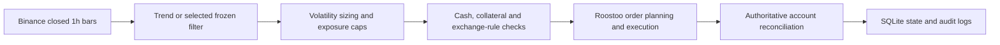

# Roostoo APAC University Quant Trading Hackathon bot

## Project overview

This repository contains the frozen five-asset Trend 8/24 competition strategy, its historical research and validation evidence, and an autonomous Roostoo execution runtime. It forms long or short targets from completed Binance hourly bars, applies portfolio and exchange constraints, then reconciles against Roostoo's actual account state. The launcher defaults to `DRY_RUN`. The General/Test account's v6 short contract was validated on 2026-10-01; AWS and Competition-account validation are still pending. See [competition readiness](docs/COMPETITION_READINESS.md).

The pre-registered final gate may select the already-frozen funding filter after its sealed holdout is released on 2026-10-04 00:00 UTC. Until its hash-locked selection artifact exists, the runtime uses the frozen Trend baseline. The gate's rules and the two candidates were fixed before the holdout release; it is not a parameter-tuning step. See `FINAL_COMPETITION_SELECTION_PREREGISTRATION.md`.

## Strategy

The baseline uses an 8-hour and 24-hour exponential moving average of each asset's hourly close. Their difference, normalized by 24-hour price dispersion, gives a signed signal: positive targets are long, negative targets are short, and a sign change leads to a reduction/close before any new opposite-side position. The selected universe is BTC, ETH, SOL, BNB, and XRP (`USDT` for Binance bars; `/USD` pairs for Roostoo).

The frozen sizing pipeline uses a 48-hour causal return-volatility estimate, 35% annual target volatility, 5% volatility floor, and maximum 3× volatility scale. Absolute target weight is capped at 35% per asset and gross weight at 1.0. A completed 00:00 UTC hourly bar supplies the daily signal; the target becomes effective on the following 01:00 UTC bar. The live launcher evaluates within 01:02–01:54 UTC after bar finalization. Research backtests use next-bar execution, never a same-bar fill. These strategy values were chosen before the live competition period and are frozen; see `PHASE2_STRATEGY_SPEC.md`, `frozen/precompetition_gate/FUNDING_VS_BASELINE_GATE.json`, and `frozen/FREEZE_MANIFEST.md`.

If the sealed final gate selects the funding challenger, it can suppress a long target when the causal 72-hour funding mean exceeds its frozen high threshold or suppress a short target when it falls below its frozen low threshold. It does not add a new asset or retune Trend 8/24. Missing required funding data halts new risk.

The primary research and runtime fee assumption is 10 basis points per side for MARKET/taker execution; research also records 5, 15, and 20 bps stress cases. The General/Test v6 short open and close verification observed fees consistent with the 10 bps assumption. No performance claim is implied by that contract check.

## Architecture



`src/quant_competition/data/` handles historical data and OHLCV validation; `binance_live.py` maintains a persistent live bar tail; `strategies/`, `portfolio/`, and `competition_selection.py` form targets; `execution.py` plans reductions before increases; `paper_runner.py` applies the schedule and safety checks; `broker.py` implements the Roostoo boundary; `live.py` persists rebalance state; and `reconciliation.py` checks post-trade exposure. Research and tests live in `research/` and `tests/`. This existing package layout is retained so imports and frozen evidence remain stable.

## Market data

Historical research uses local Binance spot one-hour OHLCV under `data/raw/` and the recorded derivatives/funding datasets where applicable. The competition provider merges those bootstrap files with public Binance spot klines and a local live cache. It returns only closed bars. Validation rejects malformed, incomplete, stale, or cross-asset-misaligned data; the runner also requires a common completed signal timestamp. Roostoo `/v3/ticker` supplies current execution prices, while Roostoo remains the authority for orders, balances, and positions. Missing or invalid ticker prices halt the cycle.

## Execution and risk controls

The production broker reads signed `/v3/balance` responses using `SpotWallet` and `MarginWallet` schema support, with `SpotWallet.USD.ShortCollateral` checked against v6 position collateral. Spot long orders use `/v3/place_order`; shorts use `POST /v6/short_open` with `pair` and `collateral`, `GET /v6/short_positions`, and `POST /v6/short_close` with `pair` and `close_qty`. It reads server-returned `ShortQty` for positions. Closing a full short uses the currently observed quantity, not a collateral/price estimate. Collateral and exposure can differ slightly from requests because exchange amount precision quantizes the fill.

The runner checks the 1.0 gross and 35% per-asset caps, available cash and locked short collateral, pending orders, out-of-universe inventory, and simultaneous long/short inventory. It floors order quantities to `AmountPrecision` and checks `MiniOrder`; if a required risk reduction cannot meet the minimum, it halts. `HALT_NEW_RISK` is also returned for stale/misaligned data, exchange-rule failure, account-read failure, or reconciliation failure. A rebalance intent is saved before execution; on restart, the runner reloads it and re-reads broker positions before planning the remaining delta. It does not automatically retry write requests after an uncertain response. The broker caps calls at 28 per rolling minute, below the published 30-call limit.

In `DRY_RUN`, the runner may make authenticated reads and compute planned orders, but returns before its order-write branch. Inspect any planned order output as a simulation. SQLite rebalance state and JSONL cycle/API audit logs are local runtime files and excluded from Git. The API log records method, path, outcome and status metadata; the runtime log records cycle status, target, planned/order response and reason. Git commits should preserve the rationale for subsequent code or deployment changes.

## Setup and verification

The project declares Python **3.11 or newer** in `pyproject.toml`. From the repository root:

```bash
python3 -m venv .venv
.venv/bin/python -m pip install -r requirements.txt
PYTHONPATH=src:research .venv/bin/python -c 'import quant_competition, run_competition_bot'
.venv/bin/python -m pytest -q
PYTHONPATH=src:research .venv/bin/python research/verify_b2e_freeze.py
```

The complete suite passed **106 tests** in a fresh Python 3.13 virtual environment during repository preparation on 2026-10-01. The B2E verifier reconstructed its frozen values within its `1e-10` tolerance (maximum difference `3.89e-15`). The sealed funding and precompetition manifests and their source hashes are retained under `frozen/`; do not rewrite them. Historical research datasets and result evidence are versioned so the project can be inspected and reproduced. Some research scripts can also fetch public data, but the live launcher needs fresh external data.

## Safe one-cycle `DRY_RUN`

Use **General/Test** credentials for a local authenticated rehearsal. Inject them through environment variables or a secure secret manager; `.env.example` contains names and placeholders only. The launcher requires credentials even for `DRY_RUN`, because it reads the live account state. It cannot complete a fully offline one-cycle run.

```bash
PYTHONPATH=src:research .venv/bin/python research/run_competition_bot.py --mode DRY_RUN --once
```

Set `ROOSTOO_API_KEY` and `ROOSTOO_SECRET_KEY` in the process environment before that command. `ROOSTOO_BASE_URL` defaults to `https://mock-api.roostoo.com`. The one-cycle command can contact public Binance and authenticated Roostoo read endpoints, but its mode does not place orders. Outside the daily due window it may return `NOT_DUE`; a `HALT_NEW_RISK` result requires inspection. Do not use the v6 execution verifier for this repository rehearsal.

## Competition deployment

After the organizer provides access, use the provided `Hackathon-Starter-Template` in the AWS Sydney region and connect through Session Manager. Check out this repository, install its requirements, inject the assigned **Competition** credentials securely into the process environment, and run authenticated read-only checks followed by the exact one-cycle `DRY_RUN` command above on AWS. Review status, reconciliation, logs, state and restart supervision before setting `ROOSTOO_COMPETITION_ACK=YES` and choosing `--mode COMPETITION`. No AWS or Competition-account validation is claimed here. The detailed operational sequence is in `COMPETITION_RUNBOOK.md`.

## Submission and audit notes

This repository keeps source, tests, frozen JSON/hash manifests, historical inputs, and research outputs together. Local credentials, caches, logs and SQLite runtime state are excluded. Commit new work with an accurate description and preserve the sealed precompetition artifacts. Do not backdate commits or treat the General/Test short test as Competition-mode authorization. The validation record is in `LIVE_API_CONTRACT_2026-10-01.md` and `docs/COMPETITION_READINESS.md`.
